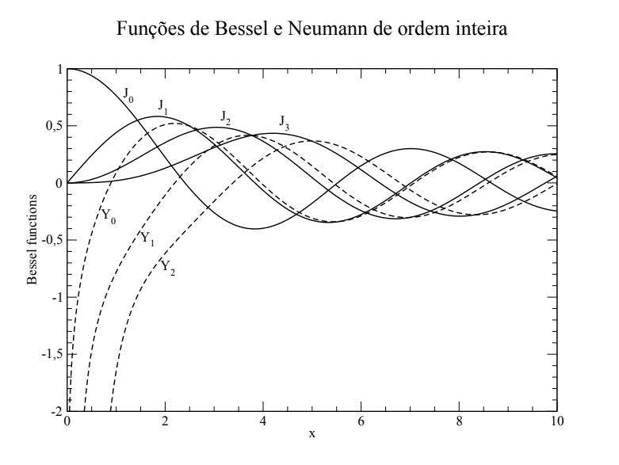

# Computational Physics using Fortran

The purpose of this repository is to introduce methods of numerical simulation of deterministic and random processes.

* Numerical Simulation in Deterministic Systems (Chaos)
* Numerical simulations in stochastic systems
* Monte Carlo integration
* Random walks
* Fractals